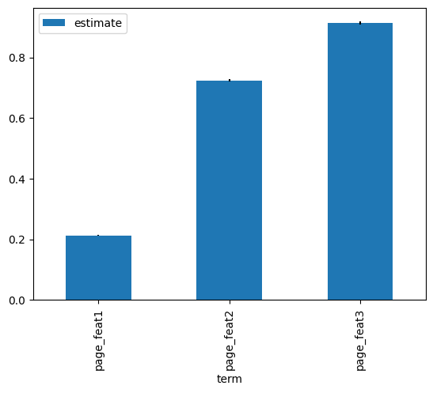
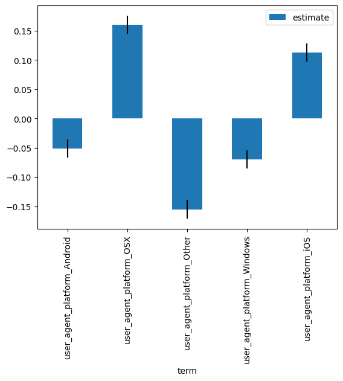
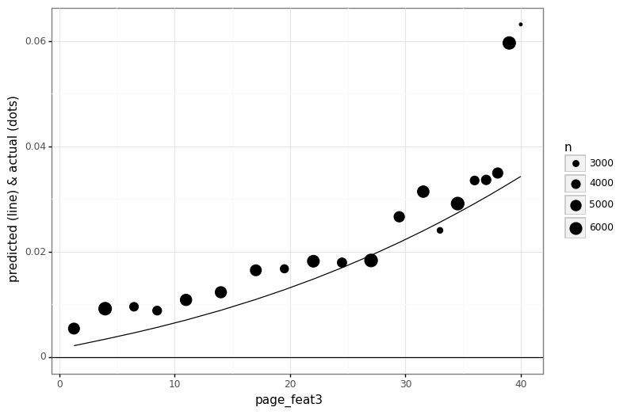

# Foundry

Foundry is a package for forging interpretable predictive modeling pipelines with a sklearn style-API. It includes:

- A `Glm` class with a [Pytorch](https://pytorch.org) backend. This class is highly extensible, supporting (almost) any distribution in pytorch's [distributions](https://pytorch.org/docs/stable/distributions.html) module.
- A `preprocessing` module that includes helpful classes like `DataFrameTransformer` and `InteractionFeatures`.
- An `evaluation` module with tools for interpreting any sklearn-API model via `MarginalEffects`.

You should use Foundry to augment your workflows if any of the following are true:

- You are attempting to model a target that is 'weird': for example, highly skewed data, binomial count-data, censored or truncated data, etc.
- You need some help battling some annoying aspects of feature-engineering: for example, you want an expressive way of specifying interaction-terms in your model; or perhaps you just want consistent support for getting feature-names despite being stuck on python 3.7.
- You want to interpret your model: for example, perform statistical inference on its parameters, or understand the direction and functional-form of its predictors.

## Getting Started

`foundry` can be installed with pip:

```bash
pip install git+https://github.com/strongio/foundry.git#egg=foundry
```

Let's walk through a quick example:


```python
# data:
from foundry.data import get_click_data
# preprocessing:
from foundry.preprocessing import DataFrameTransformer, SimpleImputer
from sklearn.preprocessing import OneHotEncoder, StandardScaler, PowerTransformer
from sklearn.pipeline import make_pipeline
# glm:
from foundry.glm import Glm
# evaluation:
from foundry.evaluation import MarginalEffects
```

Here's a dataset of click user pageviews and clicks for domain with lots of pages:


```python
df_train, df_val = get_click_data()
df_train
```


<div>
<style scoped>
    .dataframe tbody tr th:only-of-type {
        vertical-align: middle;
    }

    .dataframe tbody tr th {
        vertical-align: top;
    }

    .dataframe thead th {
        text-align: right;
    }
</style>
<table border="1" class="dataframe">
  <thead>
    <tr style="text-align: right;">
      <th></th>
      <th>attributed_source</th>
      <th>user_agent_platform</th>
      <th>page_id</th>
      <th>page_market</th>
      <th>page_feat1</th>
      <th>page_feat2</th>
      <th>page_feat3</th>
      <th>num_clicks</th>
      <th>num_views</th>
    </tr>
  </thead>
  <tbody>
    <tr>
      <th>0</th>
      <td>8</td>
      <td>Windows</td>
      <td>7</td>
      <td>b</td>
      <td>0.0</td>
      <td>0.0</td>
      <td>35.0</td>
      <td>0.0</td>
      <td>32.0</td>
    </tr>
    <tr>
      <th>1</th>
      <td>8</td>
      <td>Windows</td>
      <td>7</td>
      <td>b</td>
      <td>0.0</td>
      <td>1.0</td>
      <td>0.0</td>
      <td>0.0</td>
      <td>14.0</td>
    </tr>
    <tr>
      <th>2</th>
      <td>8</td>
      <td>Windows</td>
      <td>7</td>
      <td>a</td>
      <td>0.0</td>
      <td>0.0</td>
      <td>5.0</td>
      <td>0.0</td>
      <td>8.0</td>
    </tr>
    <tr>
      <th>3</th>
      <td>8</td>
      <td>Windows</td>
      <td>7</td>
      <td>a</td>
      <td>0.0</td>
      <td>0.0</td>
      <td>9.0</td>
      <td>0.0</td>
      <td>7.0</td>
    </tr>
    <tr>
      <th>4</th>
      <td>8</td>
      <td>Windows</td>
      <td>7</td>
      <td>a</td>
      <td>0.0</td>
      <td>0.0</td>
      <td>20.0</td>
      <td>0.0</td>
      <td>40.0</td>
    </tr>
    <tr>
      <th>...</th>
      <td>...</td>
      <td>...</td>
      <td>...</td>
      <td>...</td>
      <td>...</td>
      <td>...</td>
      <td>...</td>
      <td>...</td>
      <td>...</td>
    </tr>
    <tr>
      <th>423188</th>
      <td>1</td>
      <td>Android</td>
      <td>95</td>
      <td>f</td>
      <td>0.0</td>
      <td>0.0</td>
      <td>25.0</td>
      <td>0.0</td>
      <td>1.0</td>
    </tr>
    <tr>
      <th>423189</th>
      <td>10</td>
      <td>Android</td>
      <td>26</td>
      <td>a</td>
      <td>0.0</td>
      <td>2.0</td>
      <td>7.0</td>
      <td>15.0</td>
      <td>860.0</td>
    </tr>
    <tr>
      <th>423190</th>
      <td>10</td>
      <td>Android</td>
      <td>32</td>
      <td>a</td>
      <td>0.0</td>
      <td>0.0</td>
      <td>36.0</td>
      <td>37.0</td>
      <td>651.0</td>
    </tr>
    <tr>
      <th>423191</th>
      <td>0</td>
      <td>Other</td>
      <td>10</td>
      <td>b</td>
      <td>0.0</td>
      <td>0.0</td>
      <td>26.0</td>
      <td>0.0</td>
      <td>1.0</td>
    </tr>
    <tr>
      <th>423192</th>
      <td>0</td>
      <td>Other</td>
      <td>31</td>
      <td>a</td>
      <td>0.0</td>
      <td>1.0</td>
      <td>34.0</td>
      <td>0.0</td>
      <td>1.0</td>
    </tr>
  </tbody>
</table>
<p>423193 rows × 9 columns</p>
</div>


We'd like to build a model that let's us predict future click-rates for different pages (page_id), page-attributes (e.g. market), and user-attributes (e.g. platform), and also _learn_ about each of these features -- e.g. perform statistical inference on model-coefficients ("are users with missing user-agent data significantly worse than average?")

Unfortunately, these data don't fit nicely into the typical regression/classification divide: each observations captures _counts_ of clicks and _counts_ of pageviews. Our target is the click-rate (clicks/views) and our sample-weight is the pageviews.

One workaround would be to expand our dataset so that each row indicates `is_click` (True/False) -- then we could use a standard classification algorithm:


```python
df_train_expanded, df_val_expanded = get_click_data(expanded=True)
df_train_expanded
```


<div>
<style scoped>
    .dataframe tbody tr th:only-of-type {
        vertical-align: middle;
    }

    .dataframe tbody tr th {
        vertical-align: top;
    }

    .dataframe thead th {
        text-align: right;
    }
</style>
<table border="1" class="dataframe">
  <thead>
    <tr style="text-align: right;">
      <th></th>
      <th>attributed_source</th>
      <th>user_agent_platform</th>
      <th>page_id</th>
      <th>page_market</th>
      <th>page_feat1</th>
      <th>page_feat2</th>
      <th>page_feat3</th>
      <th>is_click</th>
    </tr>
  </thead>
  <tbody>
    <tr>
      <th>0</th>
      <td>8</td>
      <td>Windows</td>
      <td>67</td>
      <td>b</td>
      <td>0.0</td>
      <td>1.0</td>
      <td>0.0</td>
      <td>False</td>
    </tr>
    <tr>
      <th>1</th>
      <td>8</td>
      <td>Windows</td>
      <td>67</td>
      <td>b</td>
      <td>0.0</td>
      <td>1.0</td>
      <td>0.0</td>
      <td>False</td>
    </tr>
    <tr>
      <th>2</th>
      <td>8</td>
      <td>Windows</td>
      <td>67</td>
      <td>b</td>
      <td>0.0</td>
      <td>1.0</td>
      <td>0.0</td>
      <td>False</td>
    </tr>
    <tr>
      <th>3</th>
      <td>8</td>
      <td>Windows</td>
      <td>67</td>
      <td>b</td>
      <td>0.0</td>
      <td>1.0</td>
      <td>0.0</td>
      <td>False</td>
    </tr>
    <tr>
      <th>4</th>
      <td>8</td>
      <td>Windows</td>
      <td>67</td>
      <td>b</td>
      <td>0.0</td>
      <td>1.0</td>
      <td>0.0</td>
      <td>False</td>
    </tr>
    <tr>
      <th>...</th>
      <td>...</td>
      <td>...</td>
      <td>...</td>
      <td>...</td>
      <td>...</td>
      <td>...</td>
      <td>...</td>
      <td>...</td>
    </tr>
    <tr>
      <th>7760666</th>
      <td>7</td>
      <td>OSX</td>
      <td>61</td>
      <td>c</td>
      <td>3.0</td>
      <td>1.0</td>
      <td>12.0</td>
      <td>False</td>
    </tr>
    <tr>
      <th>7760667</th>
      <td>7</td>
      <td>OSX</td>
      <td>61</td>
      <td>c</td>
      <td>3.0</td>
      <td>1.0</td>
      <td>12.0</td>
      <td>False</td>
    </tr>
    <tr>
      <th>7760668</th>
      <td>7</td>
      <td>OSX</td>
      <td>61</td>
      <td>c</td>
      <td>3.0</td>
      <td>1.0</td>
      <td>12.0</td>
      <td>False</td>
    </tr>
    <tr>
      <th>7760669</th>
      <td>7</td>
      <td>OSX</td>
      <td>61</td>
      <td>c</td>
      <td>3.0</td>
      <td>1.0</td>
      <td>12.0</td>
      <td>False</td>
    </tr>
    <tr>
      <th>7760670</th>
      <td>7</td>
      <td>OSX</td>
      <td>61</td>
      <td>c</td>
      <td>3.0</td>
      <td>1.0</td>
      <td>12.0</td>
      <td>False</td>
    </tr>
  </tbody>
</table>
<p>7760671 rows × 8 columns</p>
</div>


But this is hugely inefficient: our dataset of ~400K explodes to almost 8MM. 
    
Within `foundry`, we have the `Glm`, which supports binomial data directly:


```python
Glm('binomial', penalty=10_000)
```


    Glm(family='binomial', penalty=10000)


Let's set up a sklearn model pipeline using this Glm. We'll use `foundry`'s `DataFrameTransformer` to support passing feature-names to the Glm (newer versions of sklearn support this via the `set_output()` API).


```python
preproc = DataFrameTransformer([
    (
        'one_hot', 
        make_pipeline(SimpleImputer(strategy='most_frequent'), OneHotEncoder()), 
        ['attributed_source', 'user_agent_platform', 'page_id', 'page_market']
    )
    ,
    (
        'power', 
        PowerTransformer(),
        ['page_feat1', 'page_feat2', 'page_feat3']
    )
])
```


```python
glm = make_pipeline(
    preproc, 
    Glm('binomial', penalty=1_000)
).fit(
    X=df_train,
    y={
        'value' : df_train['num_clicks'],
        'total_count' : df_train['num_views']
    },
)
```

    Epoch 8; Loss 0.3183; Convergence 0.0003131/0.001:  42%|█████▊        | 5/12 [00:00<00:00, 10.99it/s]

    Estimating laplace coefs... (you can safely keyboard-interrupt to cancel)


    Epoch 8; Loss 0.3183; Convergence 0.0003131/0.001:  42%|█████▊        | 5/12 [00:07<00:10,  1.55s/it]


By default, the `Glm` will estimate not just the parameters of our model, but also the uncertainty associated with them. We can access a dataframe of these with the `coef_dataframe_` attribute:


```python
df_coefs = glm[-1].coef_dataframe_
df_coefs
```


<div>
<style scoped>
    .dataframe tbody tr th:only-of-type {
        vertical-align: middle;
    }

    .dataframe tbody tr th {
        vertical-align: top;
    }

    .dataframe thead th {
        text-align: right;
    }
</style>
<table border="1" class="dataframe">
  <thead>
    <tr style="text-align: right;">
      <th></th>
      <th>name</th>
      <th>estimate</th>
      <th>se</th>
    </tr>
  </thead>
  <tbody>
    <tr>
      <th>0</th>
      <td>probs__one_hot__attributed_source_0</td>
      <td>0.000042</td>
      <td>0.031622</td>
    </tr>
    <tr>
      <th>1</th>
      <td>probs__one_hot__attributed_source_1</td>
      <td>-0.003277</td>
      <td>0.031578</td>
    </tr>
    <tr>
      <th>2</th>
      <td>probs__one_hot__attributed_source_2</td>
      <td>-0.058870</td>
      <td>0.030623</td>
    </tr>
    <tr>
      <th>3</th>
      <td>probs__one_hot__attributed_source_3</td>
      <td>-0.485669</td>
      <td>0.024011</td>
    </tr>
    <tr>
      <th>4</th>
      <td>probs__one_hot__attributed_source_4</td>
      <td>-0.663989</td>
      <td>0.016975</td>
    </tr>
    <tr>
      <th>...</th>
      <td>...</td>
      <td>...</td>
      <td>...</td>
    </tr>
    <tr>
      <th>141</th>
      <td>probs__one_hot__page_market_z</td>
      <td>0.353556</td>
      <td>0.025317</td>
    </tr>
    <tr>
      <th>142</th>
      <td>probs__power__page_feat1</td>
      <td>0.213486</td>
      <td>0.002241</td>
    </tr>
    <tr>
      <th>143</th>
      <td>probs__power__page_feat2</td>
      <td>0.724601</td>
      <td>0.004021</td>
    </tr>
    <tr>
      <th>144</th>
      <td>probs__power__page_feat3</td>
      <td>0.913425</td>
      <td>0.004974</td>
    </tr>
    <tr>
      <th>145</th>
      <td>probs__bias</td>
      <td>-5.166077</td>
      <td>0.022824</td>
    </tr>
  </tbody>
</table>
<p>146 rows × 3 columns</p>
</div>


Using this, it's easy to plot our model-coefficients:


```python
df_coefs[['param', 'trans', 'term']] = df_coefs['name'].str.split('__', n=3, expand=True)

df_coefs[df_coefs['name'].str.contains('page_feat')].plot('term', 'estimate', kind='bar', yerr='se')
df_coefs[df_coefs['name'].str.contains('user_agent_platform')].plot('term', 'estimate', kind='bar', yerr='se')
```


    <AxesSubplot:xlabel='term'>


    

    


    

    


Model-coefficients are limited because they only give us a single number, and for non-linear models (like our binomial GLM) this doesn't tell the whole story. For example, how could we translate the importance of `page_feat3` into understanable terms? This only gets more difficult if our model includes interaction-terms.

To aid in this, there is `MarginalEffects`, a tool for plotting our model-predictions as a function of each predictor:


```python
glm_me = MarginalEffects(glm)
glm_me.fit(
    X=df_val_expanded, 
    y=df_val_expanded['is_click'],
    vary_features=['page_feat3']
).plot()
```


    

    


    <ggplot: (8777751556441)>


Here we see that how this predictor's impact on click-rates varies due to floor effects. 

As a bonus, we ploted the actual values alongside the predictions, and we can see potential room for improvement in our model: it looks like very high values of this predictor have especially high click-rates, so an extra step in feature-engineering that captures this discontinuity may be warranted.
